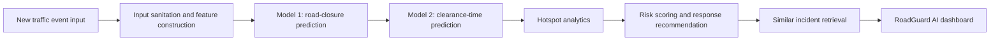

# RoadGuard AI Technical Documentation

## Project Description

RoadGuard AI is an AI-assisted traffic incident response system designed to help traffic operations teams assess live road events and decide the first field response quickly. The application combines historical traffic-event data, road-closure prediction, duration-band prediction, hotspot analytics, and similar-incident retrieval into a Streamlit dashboard that is easy for non-technical operators to use.

The core idea is simple: when a new event is reported, RoadGuard AI estimates the chance that the event will require a road closure, predicts the likely clearance-time band, identifies whether the location is historically high-risk, retrieves similar past incidents, and converts those signals into a recommended operational response plan.

## Problem Statement

RoadGuard AI addresses the problem statement direction: how can historical and real-time data be used to forecast event-related traffic impact and recommend optimal manpower, barricading, and diversion plans?

The operational challenge is event-driven congestion across both planned and unplanned situations. Political rallies, festivals, sports events, construction activities, vehicle breakdowns, accidents, tree falls, waterlogging, and sudden public gatherings can create localized traffic breakdowns with very little reaction time.

Today this is difficult because:

- Event impact is not quantified in advance.
- Resource deployment is often experience-driven.
- Field teams may not have a consistent way to compare the current event with historical incidents.
- Post-event learning is usually not built into the daily response workflow.

Traffic control teams therefore need a decision-support system that can estimate likely congestion impact, highlight high-risk locations, and recommend the first response plan before conditions escalate.

RoadGuard AI addresses this by providing:

- A closure-risk estimate for newly reported traffic events.
- A clearance-time estimate for operational planning.
- Hotspot awareness for historically sensitive areas.
- Similar past incidents to support decision-making.
- A field-ready response plan with manpower, barricading, diversion, equipment, and control-room guidance.

## Solution Overview

RoadGuard AI is built as a two-model workflow supported by analytics and retrieval layers.

1. Model 1 predicts whether a road closure is likely.
2. Model 2 predicts the expected clearance-time band using event features and the Model 1 closure signal.
3. Hotspot analytics score locations based on historical event density, closure rates, and long-duration events.
4. Similarity retrieval finds past incidents that resemble the current event.
5. The recommendation engine converts model and hotspot signals into an operational response plan.

The final system is exposed through a Streamlit dashboard named RoadGuard AI.

## Key Capabilities

- Live traffic event intake through operator-friendly fields.
- Road-closure probability and closure/no-closure decision.
- Expected clearance-time band prediction.
- Risk score and risk level assignment.
- Recommended field plan in tabular format.
- Priority actions displayed as horizontal action cards.
- Similar past events table.
- Hotspot map for city-wide attention areas.
- Optional Mappls integration with OAuth-based token generation.
- Render deployment support through `render.yaml`.

## Repository Structure

```text
app/
  streamlit_app.py
  pipeline_engine.py
  hotspot_analytics.py
  risk_scoring_recommendation_engine.py
  similarity_incident_retrieval.py

data/
  Astram event data_anonymized - Astram event data_anonymizedb40ac87.csv

notebooks/
  EDA/
  feature_engineering/
  model1/
  model2/

outputs/
  features/
  model_road_closure/
  model_duration_band/

README.md
render.yaml
render-requirements.txt
requirements.txt
```

## System Architecture



## Data Pipeline

The project starts from anonymized historical traffic event data. The feature-engineering notebooks transform the raw event data into leakage-safe model-ready datasets.

Important data preparation steps include:

- Timestamp parsing.
- Incident duration calculation.
- Report-lag calculation.
- Invalid duration filtering for duration modeling.
- Location-based feature creation.
- Time-of-day, weekday, month, and peak-period features.
- Text-derived incident flags.
- Event-cause, corridor, zone, junction, police-station, and vehicle-type encoding.
- Leakage policy enforcement to exclude post-incident fields from prediction inputs.

The main kept feature outputs are:

```text
outputs/features/road_closure_features_v1.csv
outputs/features/duration_base_features_v1.csv
```

## Leakage-Safe Design

The project explicitly avoids using fields that would only be known after an event has progressed or closed. This is important because the app is intended for live operational use, not only offline backtesting.

Excluded or avoided leakage sources include:

- Closure confirmation after the event.
- Actual duration as an input feature.
- Post-hoc resolution fields.
- After-the-fact reports that would not be available at event creation time.

The output feature tables are designed to represent what an operator could reasonably know when the incident is first reported.

## Model 1: Road-Closure Prediction

Model 1 predicts the probability that a new event will require a road closure.

Current production artifact:

```text
outputs/model_road_closure/model1_inference_bundle.pkl
```

The active implementation loads this bundle in `app/pipeline_engine.py` and uses:

- Calibrated LightGBM probability.
- Calibrated XGBoost probability.
- Weighted ensemble probability.
- Operational threshold stored in the model bundle.

Current bundle details:

- LightGBM weight: `0.95`
- XGBoost weight: `0.05`
- Operational threshold: approximately `0.281`
- Model input columns: `91`
- Encoded feature columns: `638`

Model 1 output:

```text
road_closure_probability
road_closure_label
model1_threshold
lgb_calibrated_probability
xgb_calibrated_probability
```

The closure probability is passed forward into Model 2 and the recommendation engine.

## Model 2: Clearance-Time Prediction

Model 2 predicts the likely clearance-time band for the event.

Current production artifact:

```text
outputs/model_duration_band/model2_duration_band_inference_bundle.pkl
```

The model predicts one of the following duration bands:

- `short`
- `medium`
- `long`
- `very_long`

The Model 2 inference bundle includes:

- Model input columns.
- Class order.
- Trained model components.
- Optional class multipliers.
- Optional very-long threshold adjustment.

Model 2 receives the live feature row plus the Model 1 road-closure probability. This allows the duration estimate to account for whether the event is likely to become a closure event.

Model 2 output:

```text
predicted_duration_band
prediction_confidence
prob_short
prob_medium
prob_long
prob_very_long
```

## Hotspot Analytics

Hotspot analytics identify high-attention areas based on historical incidents. The logic groups events by:

- Corridor.
- Junction.
- Police station.

It then computes:

- Total events.
- Closure events.
- Closure rate.
- Long-duration event count.
- Accident count.
- Breakdown count.
- Waterlogging count.
- Hotspot score.
- Hotspot level.

The hotspot score is used in the dashboard and the response recommendation logic to highlight areas that may need faster attention.

## Similar Incident Retrieval

The similarity layer helps operators understand how similar incidents behaved historically.

It uses:

- Structured features such as location, time, report lag, and closure probability.
- Lightweight text-derived features from the event description.
- Standard scaling.
- PCA for text-derived numeric signals where useful.
- Nearest-neighbor retrieval using cosine distance.

The dashboard displays similar past incidents with fields such as:

- Time.
- Cause.
- Corridor.
- Police station.
- Junction.
- Zone.
- Clearance-time band.
- Risk level.
- Risk score.

## Recommendation Engine

The recommendation engine turns model outputs and hotspot signals into operational guidance.

It produces:

- Overall risk score.
- Risk level.
- Confidence bucket.
- Manpower recommendation.
- Barricading recommendation.
- Diversion guidance.
- Control-room update guidance.
- Equipment list.
- Agency alerts.
- Primary trigger reason.

The dashboard presents this as:

- Situation Snapshot.
- Recommended Field Plan.
- Priority Actions.
- Similar Past Events.
- Hotspot View.

## Application Workflow

1. Operator opens RoadGuard AI.
2. Operator enters event details such as cause, corridor, police station, junction, zone, coordinates, vehicle type, and description.
3. The app sanitizes and normalizes the input.
4. A feature row is built from the best matching historical template and live input values.
5. Model 1 predicts road-closure probability.
6. Model 2 predicts clearance-time band.
7. Hotspot analytics score the location context.
8. Recommendation logic generates a field plan.
9. Similar incidents are retrieved.
10. The dashboard displays the response plan and hotspot view.

## Dashboard UX

The current dashboard is designed for operational users rather than data scientists.

Main screens:

- `Response Plan`: event input, risk summary, recommended plan, priority actions, and similar past incidents.
- `Hotspot View`: map-based attention view for historical and live event context.

Technical labels were replaced with operational language. For example:

- `event_type` becomes `Event type`.
- `veh_type` becomes `Vehicle type`.
- `predicted_duration_band` becomes `Expected Clearance Time`.
- `road_closure_probability` becomes `Chance of Road Closure`.

## Mappls Integration

RoadGuard AI supports Mappls for map and heatmap rendering.

Credentials can be provided through either:

- Streamlit secrets in `.streamlit/secrets.toml`.
- Environment variables in deployment platforms such as Render.

Supported values:

```text
CLIENT_ID
CLIENT_SECRET
MAPPLS_STATIC_KEY
MAPPLS_ACCESS_TOKEN
```

The app first tries OAuth token generation using `CLIENT_ID` and `CLIENT_SECRET`. If those are not available, it falls back to a static Mappls key or access token.

If Mappls credentials are not available, the app falls back to Streamlit's basic map rendering.

## Deployment

The repo includes Render deployment support.

Deployment files:

```text
render.yaml
render-requirements.txt
```

Render service type:

```text
Web Service
```

Build command:

```bash
pip install -r render-requirements.txt
```

Start command:

```bash
streamlit run app/streamlit_app.py --server.address 0.0.0.0 --server.port $PORT --server.headless true
```

Required Render environment variables:

```text
CLIENT_ID
CLIENT_SECRET
```

Optional:

```text
MAPPLS_STATIC_KEY
```

## Local Setup

Create a virtual environment:

```bash
python3 -m venv .venv
source .venv/bin/activate
```

Install dependencies:

```bash
pip install -r requirements.txt
```

Run the app:

```bash
streamlit run app/streamlit_app.py
```

Or:

```bash
.venv/bin/streamlit run app/streamlit_app.py
```

## Key Technical Files

```text
app/streamlit_app.py
```

Defines the RoadGuard AI dashboard, input form, Mappls integration, response-plan UI, hotspot view, and deployment-friendly secret loading.

```text
app/pipeline_engine.py
```

Coordinates the complete prediction workflow, including input sanitation, feature-row construction, model loading, Model 1 prediction, Model 2 prediction, scoring, and similar-incident lookup.

```text
app/risk_scoring_recommendation_engine.py
```

Builds response plans and risk scoring logic.

```text
app/hotspot_analytics.py
```

Builds hotspot summaries and map heat points.

```text
app/similarity_incident_retrieval.py
```

Builds the retrieval index and queries similar incidents.

## Future Enhancements

### Continuous Learning Pipeline

Implement an automated feedback loop to periodically retrain prediction models using newly recorded traffic events. This would allow RoadGuard AI to continuously adapt to evolving traffic patterns, changing road networks, seasonal event behavior, and updated field-response practices.

### Mini LLM-Based Decision Assistant

Integrate a lightweight multilingual LLM to generate real-time operational summaries, explain AI recommendations in natural language, and provide bilingual English-Kannada traffic advisories for field officers and public information dissemination.

### Traffic Signal Integration

Integrate adaptive traffic signal control systems to dynamically optimize signal timings based on predicted congestion severity and recommended diversion strategies. This would connect RoadGuard AI recommendations directly with signal operations for faster corridor-level response.

### Incident Feedback and Post-Event Learning

Capture actual field outcomes such as clearance time, manpower used, diversion effectiveness, and escalation status after each event. This would create a practical post-event learning loop and improve future recommendations.

### Control-Room and Field-Team Integrations

Add integrations with control-room alerting tools, field-officer mobile workflows, and agency coordination channels so that recommendations can be shared directly with the teams responsible for execution.

## Impact

RoadGuard AI helps traffic teams move from reactive incident handling to data-supported response planning. It reduces the time needed to assess an event, gives operators historical context, highlights hotspot risk, and converts model predictions into field-ready actions.

The project is designed to be practical: it uses live-style leakage-safe inputs, deployable model artifacts, and an operator-friendly dashboard that can run locally or on Render.
