# GridLock Phase 2 — Detailed Architecture Diagram

## System Overview

```
 ╔══════════════════════════════════════════════════════════════════════════════╗
 ║                    EventOps AI — End-to-End Pipeline                       ║
 ║                                                                            ║
 ║  Raw Astram CSV ──► Block 1 ──► Block 2 ──► Block 3 ──► Block 4 ──►       ║
 ║                     Clean &     Feature     Road        Duration            ║
 ║                     Label       Engineer    Closure     Band                ║
 ║                                             Model       Model              ║
 ║                                                                    ──►     ║
 ║                                             Block 5 ──► Block 6            ║
 ║                                             Risk &      Streamlit          ║
 ║                                             Recommend   Dashboard          ║
 ╚══════════════════════════════════════════════════════════════════════════════╝
```

---

## Full Pipeline Flow (Mermaid)

```mermaid
flowchart TB
    subgraph INPUT["DATA SOURCE"]
        RAW["Raw Astram Event CSV<br/>8,173 rows × 46 columns<br/>Bengaluru traffic events"]
    end

    subgraph BLOCK1["BLOCK 1: DATA CLEANING & LABEL CREATION"]
        B1_CLEAN["Column standardization<br/>Null normalization<br/>Date-time parsing (UTC→IST)"]
        B1_COORD["Coordinate cleaning<br/>Bengaluru bounding box validation<br/>Start/End/Resolved location flags"]
        B1_LABEL1["Road Closure Label<br/>requires_road_closure → target_road_closure<br/>Binary: 0/1 (91.7% / 8.3%)"]
        B1_LABEL2["Duration Band Label<br/>Earliest terminal timestamp<br/>short(<60m) / medium(1-4h) / long(>4h)<br/>2,764 valid rows (cap: 24h)"]
        B1_LEAK["Leakage Policy<br/>33 prediction-time-safe columns<br/>26 future/label-only blocked<br/>11 ID/admin excluded"]
        B1_AUDIT["Audit features<br/>report_lag, start_hour, day_of_week<br/>is_weekend, is_peak_hour, is_night"]
    end

    subgraph BLOCK2["BLOCK 2: FEATURE ENGINEERING"]
        B2_NUM["Numeric & Spatial<br/>lat/lon, distance_to_city_center<br/>location_grid (0.001° cells)<br/>coordinate quality flags"]
        B2_TEMP["Temporal Features<br/>hour_sin/cos, day_sin/cos<br/>start_weekofyear, peak_period<br/>report_lag_clipped, reporting_delay"]
        B2_TEXT["Text & NLP Features<br/>description length, word count<br/>Kannada text detection<br/>10 keyword patterns:<br/>accident/breakdown/water/construction<br/>event/blocked/jam/vip/location/emergency"]
        B2_CAT["Categorical Grouping<br/>12 source columns grouped<br/>(event_cause, corridor, zone,<br/>junction, police_station, etc.)<br/>Rare → 'other_rare' (min_count=20-30)"]
        B2_DOMAIN["Domain Flags<br/>is_planned, is_breakdown, is_accident<br/>is_heavy_vehicle, is_bus, is_truck<br/>has_cargo, truck_age_band"]
        B2_INTER["Interaction Features<br/>cause×corridor, cause×peak_period<br/>zone×cause, corridor×peak<br/>cause×heavy_vehicle<br/>Rare combos grouped"]
        B2_HIST["Prior-Only Historical Stats<br/>Cumulative count & closure rate<br/>per: event_cause, corridor, zone,<br/>junction, police_station,<br/>location_grid, cause×corridor<br/>Strictly chronological (no leakage)"]
        B2_ENCODE["Encoding & Selection<br/>Target encoding (smoothed, λ=30)<br/>cause_base_closure_rate, severity_rank<br/>corridor_is_major, priority_is_high<br/>description_urgency_score<br/>Near-zero-variance filter (<0.5%)"]
    end

    subgraph BLOCK3["BLOCK 3: MODEL 1 — ROAD CLOSURE CLASSIFIER"]
        B3_SPLIT["Chronological 4-Way Split<br/>Train: 56% | Cal: 14% | Val: 15% | Test: 15%<br/>Separate calibration prevents val leakage"]
        B3_PREPROC["Preprocessing Pipeline<br/>Numeric: median impute<br/>Categorical: OHE (min_freq=20)<br/>ColumnTransformer → float32"]
        B3_SELECT["Feature Selection<br/>LightGBM SelectFromModel<br/>threshold = 0.5×mean importance<br/>~569 encoded → ~selected subset"]
        B3_SMOTE["SMOTE Oversampling<br/>Minority → 40% of majority<br/>Training data only<br/>Fallback: random oversample"]
        B3_BASELINE["Baseline: Logistic Regression<br/>StandardScaler → class_weight=balanced"]
        B3_LGB["LightGBM Default<br/>num_leaves=31, lr=0.05<br/>scale_pos_weight, early_stopping"]
        B3_XGB["XGBoost Default<br/>max_depth=6, lr=0.05<br/>scale_pos_weight, early_stopping"]
        B3_OPTUNA["Optuna HPO (30 trials each)<br/>Objective: 0.6×PR-AUC + 0.4×best-F1<br/>LightGBM: leaves, depth, lr, regularization<br/>XGBoost: depth, lr, subsample, gamma, reg"]
        B3_CAL["Sigmoid Calibration<br/>Platt scaling per model<br/>Fitted on DEDICATED calibration split<br/>(not val — prevents double-dipping)"]
        B3_ENSEMBLE["Soft-Voting Ensemble<br/>Weight search: 21 combos on val set<br/>Best PR-AUC → LGB_w + XGB_w = 1.0<br/>Weights selected on clean val data"]
        B3_THRESH["Robust Threshold Selection<br/>Val-optimal: F1 plateau (tol=0.01)<br/>CV: 5-fold StratifiedKFold on train<br/>Blended: 60% val + 40% CV mean"]
        B3_SHAP["SHAP Explainability<br/>TreeExplainer on LightGBM<br/>Feature importance (gain) for both models"]
        B3_HANDOFF["Forward-Chaining Handoff<br/>5-fold expanding window<br/>Per-fold LGB + calibration<br/>Prevents in-sample probability leak<br/>→ model2_duration_handoff.csv"]
    end

    subgraph BLOCK4["BLOCK 4: MODEL 2 — DURATION BAND CLASSIFIER"]
        B4_STACK["Stacked Input<br/>All Block 2 features + road_closure_probability<br/>2,764 rows × 537 columns<br/>3-class: short(57%) / medium(33%) / long(10%)"]
        B4_SPLIT2["Stratified 70/15/15 Split<br/>Preserves rare 'long' class in each split"]
        B4_SMOTE2["SMOTE Oversampling<br/>All classes → majority count<br/>Training data only"]
        B4_SELECT2["Feature Selection<br/>SelectFromModel (XGBoost importance)<br/>Reduces ~536 to selected subset"]
        B4_RF["Random Forest Baseline<br/>500 trees, balanced_subsample<br/>class_weight=balanced"]
        B4_XGB2["XGBoost Multi-Class<br/>compute_sample_weight('balanced')<br/>Improved hyperparameters"]
        B4_CAT2["CatBoost Candidate<br/>auto_class_weights='Balanced'<br/>Uses selected features"]
        B4_BEST["Model Selection<br/>Best macro-F1 on validation<br/>Handles selected feature alignment"]
    end

    subgraph BLOCK5["BLOCK 5: RISK SCORING & RECOMMENDATION ENGINE"]
        B5_PREDICT["Duration Prediction<br/>Score all 2,764 valid-duration rows<br/>Uses Model 2 + selected features<br/>prediction_confidence = max(class_proba)"]
        B5_HOTSPOT["Hotspot Detection<br/>Group by: corridor × junction × police_station<br/>Metrics: total_events, closure_rate,<br/>long_duration_events, accident/breakdown/water<br/>hotspot_score = 0.35×events + 0.45×closure_rate×100 + 0.80×long_events<br/>Levels: low / medium / high / critical<br/>642 unique location groups"]
        B5_RULES["Rule-Based Scoring<br/>risk_score = closure_prob×45<br/>  + duration_points × confidence_weight<br/>  + hotspot_score×0.30 (cap 40)<br/>  + peak_bonus(5) + blocked_bonus(4)<br/>  + cause_bonus (5-18 by type)<br/>Clip: [0, 100]"]
        B5_OVERRIDE["Cause Overrides (10 types)<br/>vehicle_breakdown: +8, tow van<br/>accident: +14, ambulance, tow van<br/>tree_fall: +16, BBMP clearance<br/>water_logging: +14, pump support<br/>vip_movement: +18, pilot route<br/>public_event/procession: +12<br/>construction: +8, pot_holes: +5<br/>congestion: +6"]
        B5_BUMP["Level Escalation Rules<br/>long + closure≥0.60 → bump +1<br/>accident/tree/vip + closure≥0.50 → bump +1<br/>Low confidence + low closure → downgrade"]
        B5_PLAYBOOK["Playbook Generation<br/>Per risk level:<br/>• low: 1 patrol, log & monitor<br/>• medium: 2 officers, local channelization<br/>• high: 4-6 officers, partial diversion<br/>• critical: 8+ officers, full diversion<br/>Equipment & agency alerts by cause"]
        B5_CONF["Confidence-Aware Scoring<br/>confidence_bucket: high(≥0.70) / med(≥0.50) / low(<0.50)<br/>Duration contribution scaled by weight:<br/>high=1.0, medium=0.85, low=0.70"]
    end

    subgraph BLOCK6["BLOCK 6: STREAMLIT COMMAND DASHBOARD"]
        B6_BOARD["Command Board Tab<br/>KPI cards: events, critical, high+, avg closure, avg risk<br/>Risk distribution bar chart<br/>Duration distribution bar chart<br/>Priority queue (top 50 by risk_score)"]
        B6_PLAY["Playbook Explorer Tab<br/>Select event → risk badge, score, closure prob<br/>Event context: cause, corridor, junction<br/>Response: manpower, barricading, diversion<br/>Equipment, agency alerts, control room<br/>Map view (lat/lon)"]
        B6_HOT["Hotspot Analytics Tab<br/>Filter by hotspot level<br/>Table: corridor, junction, police_station<br/>Events, closure rate, long events, score"]
        B6_MODEL["Model Performance Tab<br/>Model 1: PR-AUC, ROC-AUC, Recall, F1<br/>Model 2: Macro-F1, Balanced Acc, Weighted-F1<br/>Model comparison table<br/>Per-class metrics"]
        B6_FILTER["Sidebar Filters<br/>Risk level multi-select<br/>Event cause, corridor<br/>Closure ≥50%, high hotspots only<br/>Event ID / description search"]
    end

    RAW --> B1_CLEAN --> B1_COORD --> B1_LABEL1
    B1_CLEAN --> B1_LABEL2
    B1_CLEAN --> B1_LEAK
    B1_CLEAN --> B1_AUDIT

    B1_LABEL1 --> B2_NUM
    B1_LABEL2 --> B2_NUM
    B1_LEAK --> B2_CAT
    B2_NUM --> B2_TEMP --> B2_TEXT --> B2_CAT
    B2_CAT --> B2_DOMAIN --> B2_INTER --> B2_HIST --> B2_ENCODE

    B2_ENCODE -->|"model_ready_road_closure.csv<br/>8,173 × ~100 features"| B3_SPLIT
    B3_SPLIT --> B3_PREPROC --> B3_SELECT --> B3_SMOTE
    B3_SMOTE --> B3_BASELINE
    B3_SMOTE --> B3_LGB
    B3_SMOTE --> B3_XGB
    B3_LGB --> B3_OPTUNA
    B3_XGB --> B3_OPTUNA
    B3_OPTUNA --> B3_CAL --> B3_ENSEMBLE --> B3_THRESH
    B3_THRESH --> B3_SHAP
    B3_THRESH --> B3_HANDOFF

    B3_HANDOFF -->|"model2_duration_handoff.csv<br/>+ road_closure_probability"| B4_STACK
    B2_ENCODE -->|"model_ready_duration_band.csv<br/>2,764 × ~100 features"| B4_STACK
    B4_STACK --> B4_SPLIT2 --> B4_SMOTE2 --> B4_SELECT2
    B4_SELECT2 --> B4_RF
    B4_SELECT2 --> B4_XGB2
    B4_SELECT2 --> B4_CAT2
    B4_RF --> B4_BEST
    B4_XGB2 --> B4_BEST
    B4_CAT2 --> B4_BEST

    B4_BEST -->|"model2_v2_duration_band_model.pkl"| B5_PREDICT
    B3_HANDOFF -->|"road_closure_probability"| B5_PREDICT
    B5_PREDICT --> B5_HOTSPOT
    B5_PREDICT --> B5_RULES
    B5_HOTSPOT --> B5_RULES
    B5_RULES --> B5_OVERRIDE --> B5_BUMP --> B5_PLAYBOOK
    B5_RULES --> B5_CONF --> B5_PLAYBOOK

    B5_PLAYBOOK -->|"event_risk_playbooks.csv<br/>hotspot_summary.csv<br/>recommendation_rules.json"| B6_BOARD
    B5_PLAYBOOK --> B6_PLAY
    B5_HOTSPOT --> B6_HOT
    B3_THRESH -->|"model1_v2_metrics.json"| B6_MODEL
    B4_BEST -->|"model2_v2_metrics.json"| B6_MODEL
    B6_BOARD --> B6_FILTER
    B6_PLAY --> B6_FILTER
```



---

## Block-by-Block Detailed Breakdown

### Block 1: Data Cleaning & Label Creation

```
Notebook: 01_data_cleaning_labels/01_data_cleaning_and_label_creation.ipynb

INPUT
  └── data/Astram event data_anonymized.csv (8,173 rows × 46 columns)

PROCESSING STEPS
  ┌─────────────────────────────────────────────────────┐
  │ 1. Column Standardization                           │
  │    • strip, lowercase, replace spaces with _        │
  │    • Null normalization: '', 'NULL', 'None' → NaN   │
  ├─────────────────────────────────────────────────────┤
  │ 2. Date-Time Parsing                                │
  │    • 6 datetime columns parsed as UTC               │
  │    • IST versions created (Asia/Kolkata)            │
  │    • Columns: start_datetime, end_datetime,         │
  │      created_date, modified_datetime,               │
  │      closed_datetime, resolved_datetime             │
  ├─────────────────────────────────────────────────────┤
  │ 3. Coordinate Cleaning                              │
  │    • Zero values → NaN                              │
  │    • Bengaluru bounding box: lat 12-14, lon 76-78.5 │
  │    • Flags: valid_start_coordinate,                 │
  │      has_start_location, has_raw_end_location,      │
  │      has_resolved_location                          │
  ├─────────────────────────────────────────────────────┤
  │ 4. Road Closure Label (Model 1 Target)              │
  │    • requires_road_closure → target_road_closure    │
  │    • Binary: 0 = No (7,497 = 91.7%)                │
  │              1 = Yes (676 = 8.3%)                   │
  │    • Severe class imbalance                         │
  ├─────────────────────────────────────────────────────┤
  │ 5. Duration Band Label (Model 2 Target)             │
  │    • Terminal timestamp = min(end, resolved, closed) │
  │    • Duration = terminal - start (minutes)          │
  │    • Valid: 0 < duration ≤ 1440 min (24h cap)       │
  │    • Bands: short(<60m) = 57.2%                     │
  │             medium(1-4h) = 32.7%                    │
  │             long(>4h) = 10.1%                       │
  │    • Valid rows: 2,764 / 8,173                      │
  ├─────────────────────────────────────────────────────┤
  │ 6. Leakage Policy Documentation                     │
  │    • 33 prediction-time-safe columns (features ok)  │
  │    • 26 future/label-only (BLOCKED from features)   │
  │    • 11 ID/admin columns (excluded)                 │
  │    • 2 target columns                               │
  ├─────────────────────────────────────────────────────┤
  │ 7. Audit Features                                   │
  │    • report_lag_minutes (created - start)            │
  │    • start_hour, start_dayofweek, start_month       │
  │    • is_weekend, is_peak_hour, is_night             │
  └─────────────────────────────────────────────────────┘

OUTPUT
  ├── outputs/cleaned/cleaned_events_with_labels.csv (8,173 × 72)
  ├── outputs/cleaned/label_summary.csv
  └── outputs/cleaned/leakage_policy.csv
```

---

### Block 2: Feature Engineering

```
Notebook: 02_feature_engineering/02_feature_engineering_model_ready_datasets.ipynb

INPUT
  ├── outputs/cleaned/cleaned_events_with_labels.csv
  └── outputs/cleaned/leakage_policy.csv

FEATURE CATEGORIES
  ┌─────────────────────────────────────────────────────────────────────┐
  │ A. Numeric & Spatial (5 features)                                  │
  │    • latitude, longitude, valid_start_coordinate                   │
  │    • has_start_location                                            │
  │    • distance_to_city_center_km (haversine from 12.97, 77.59)     │
  │    • location_grid (lat×lon rounded to 0.001°, grouped min=15)    │
  ├─────────────────────────────────────────────────────────────────────┤
  │ B. Temporal (14 features)                                          │
  │    • start_hour, start_dayofweek, start_weekofyear                │
  │    • hour_sin, hour_cos (cyclic encoding)                         │
  │    • day_sin, day_cos (cyclic encoding)                           │
  │    • is_weekend, is_peak_hour (7-9, 17-20), is_night (22-5)      │
  │    • report_lag_minutes_clipped [-60, 1440]                       │
  │    • report_lag_hours_clipped [-1, 24]                            │
  │    • report_lag_is_negative, reporting_delay_minutes              │
  ├─────────────────────────────────────────────────────────────────────┤
  │ C. Text / NLP (14 features)                                        │
  │    • text_length, description_char_length, description_word_count │
  │    • has_non_ascii_text, has_kannada_text                         │
  │    • 10 keyword flags:                                            │
  │      has_accident_word, has_breakdown_word, has_water_word,       │
  │      has_construction_word, has_event_word, has_blocked_word,     │
  │      has_jam_word, has_vip_word, has_location_hint_word,          │
  │      has_emergency_word                                           │
  ├─────────────────────────────────────────────────────────────────────┤
  │ D. Categorical Grouping (12 grouped columns)                       │
  │    • event_type, event_cause, direction, veh_type                 │
  │    • corridor, priority, cargo_material, reason_breakdown         │
  │    • police_station, zone, junction, authenticated                │
  │    • Rare categories → 'other_rare' (min_count varies 10-30)     │
  ├─────────────────────────────────────────────────────────────────────┤
  │ E. Domain Flags (13 features)                                      │
  │    • is_planned_event, is_public_or_vip_event                     │
  │    • is_breakdown_event, is_accident_event                        │
  │    • is_weather_or_visibility_event, is_road_condition_event      │
  │    • has_vehicle_type, is_truck, is_bus, is_two_wheeler           │
  │    • is_heavy_vehicle, has_cargo_material                         │
  │    • age_of_truck (clipped 0-50), truck_age_missing               │
  ├─────────────────────────────────────────────────────────────────────┤
  │ F. Interaction Features (8 features)                               │
  │    • event_cause × corridor                                       │
  │    • cause × peak_period (morning/evening/night/off_peak)         │
  │    • zone × cause                                                 │
  │    • corridor × cause                                             │
  │    • cause × heavy_vehicle                                        │
  │    • corridor × peak_period                                       │
  │    • start_day_name, start_month                                  │
  │    • Rare combos grouped (min_count=20)                           │
  ├─────────────────────────────────────────────────────────────────────┤
  │ G. Prior-Only Historical Features (14 features)                    │
  │    • For 7 group columns, compute:                                │
  │      - past_count_{group}: cumulative events before current row   │
  │      - past_closure_rate_{group}: cumulative closure rate before  │
  │    • Groups: event_cause, corridor, zone, junction,               │
  │      police_station, location_grid, cause×corridor               │
  │    • Strictly chronological: current row's label NEVER included   │
  │    • Global prior fallback when group has no history              │
  ├─────────────────────────────────────────────────────────────────────┤
  │ H. Engineered Priors & Encoding                                    │
  │    • cause_base_closure_rate (static EDA rates, non-leaking)      │
  │    • cause_severity_rank (dense rank of closure rate)             │
  │    • corridor_is_major (11 major Bengaluru corridors)             │
  │    • priority_is_high, is_authenticated                           │
  │    • description_urgency_score (sum of keyword flags)             │
  │    • Target encoding: smoothed (λ=30) for all categoricals       │
  │    • Near-zero-variance filter: drop columns with <0.5% nonzero  │
  └─────────────────────────────────────────────────────────────────────┘

OUTPUT
  ├── outputs/feature_engineering/model_ready_road_closure.csv (8,173 × ~100)
  ├── outputs/feature_engineering/model_ready_duration_band.csv (2,764 × ~100)
  ├── outputs/feature_engineering/feature_columns.json
  └── outputs/feature_engineering/feature_engineering_summary.csv
```

---

### Block 3: Model 1 — Road Closure Classifier

```
Notebook: 03_model1_road_closure_classifier.ipynb
    Also: model1/model_road_closure.ipynb (alternative with ensemble)

INPUT
  ├── outputs/feature_engineering/model_ready_road_closure.csv
  └── outputs/feature_engineering/model_ready_duration_band.csv

PIPELINE
  ┌─────────────────────────────────────────────────────────────────────┐
  │ 1. DATA SPLIT (Chronological 4-Way)                                │
  │                                                                    │
  │    ┌──────────┬──────────┬──────────┬──────────┐                   │
  │    │  Train   │   Cal    │   Val    │   Test   │                   │
  │    │   56%    │   14%    │   15%    │   15%    │                   │
  │    │ ~4577 r  │ ~1144 r  │ ~1226 r  │ ~1226 r  │                   │
  │    └──────────┴──────────┴──────────┴──────────┘                   │
  │    Time ─────────────────────────────────────────►                 │
  │                                                                    │
  │    Key: Calibration is carved FROM training data,                  │
  │         NOT from validation (prevents leakage)                    │
  ├─────────────────────────────────────────────────────────────────────┤
  │ 2. PREPROCESSING PIPELINE                                          │
  │                                                                    │
  │    Raw Features                                                    │
  │         │                                                          │
  │         ▼                                                          │
  │    ColumnTransformer                                               │
  │    ├── Numeric: SimpleImputer(median)                              │
  │    └── Categorical: SimpleImputer('unknown') → OneHotEncoder       │
  │              (handle_unknown='infrequent_if_exist', min_freq=20)   │
  │         │                                                          │
  │         ▼                                                          │
  │    ~569 encoded features (float32)                                 │
  ├─────────────────────────────────────────────────────────────────────┤
  │ 3. FEATURE SELECTION                                               │
  │                                                                    │
  │    LightGBM (200 trees, depth=4) → SelectFromModel                │
  │    Threshold: 0.5 × mean importance                               │
  │    ~569 features → selected subset (keeps most informative)       │
  ├─────────────────────────────────────────────────────────────────────┤
  │ 4. SMOTE OVERSAMPLING (Training Only)                              │
  │                                                                    │
  │    Before: ~8% positive (severe imbalance)                        │
  │    Strategy: minority → 40% of majority count                     │
  │    After: ~29% positive (balanced for learning)                   │
  │    Fallback: random oversampling if imblearn unavailable           │
  ├─────────────────────────────────────────────────────────────────────┤
  │ 5. MODEL TRAINING                                                  │
  │                                                                    │
  │    ┌────────────┐  ┌────────────┐  ┌────────────┐                 │
  │    │  Logistic   │  │  LightGBM  │  │  XGBoost   │                │
  │    │ Regression  │  │  Default   │  │  Default   │                │
  │    │ (baseline)  │  │            │  │            │                │
  │    └──────┬─────┘  └──────┬─────┘  └──────┬─────┘                │
  │           │               │               │                       │
  │           │         ┌─────┴─────┐   ┌─────┴─────┐                │
  │           │         │  Optuna   │   │  Optuna   │                │
  │           │         │ 30 trials │   │ 30 trials │                │
  │           │         └─────┬─────┘   └─────┬─────┘                │
  │           │               │               │                       │
  │    Optuna objective: 0.6×PR-AUC + 0.4×best-F1                    │
  │    Hyperparameters tuned:                                          │
  │    • LGB: num_leaves, max_depth, lr, min_child_samples,           │
  │      bagging/feature_fraction, reg_alpha/lambda, scale_pos_weight │
  │    • XGB: max_depth, lr, subsample, colsample_bytree,             │
  │      min_child_weight, gamma, reg_alpha/lambda, scale_pos_weight  │
  ├─────────────────────────────────────────────────────────────────────┤
  │ 6. CALIBRATION (on Dedicated Cal Split)                            │
  │                                                                    │
  │    ┌──────────┐     ┌──────────┐                                  │
  │    │ LightGBM │     │ XGBoost  │                                  │
  │    │ (tuned)  │     │ (tuned)  │                                  │
  │    └────┬─────┘     └────┬─────┘                                  │
  │         │                │                                         │
  │    ┌────▼─────┐     ┌────▼─────┐                                  │
  │    │ Sigmoid  │     │ Sigmoid  │     Fitted on X_cal, y_cal       │
  │    │ (Platt)  │     │ (Platt)  │     NOT on validation set        │
  │    │ Calib.   │     │ Calib.   │                                  │
  │    └────┬─────┘     └────┬─────┘                                  │
  │         │                │                                         │
  │    ┌────▼────────────────▼─────┐                                  │
  │    │   Soft-Voting Ensemble    │                                  │
  │    │   w_lgb×P_lgb + w_xgb×P_xgb                                 │
  │    │   Weights: grid search on val PR-AUC                         │
  │    │   (21 weight combos, 0.0 to 1.0 step 0.05)                  │
  │    └────────────┬──────────────┘                                  │
  │                 │                                                  │
  │    ┌────────────▼──────────────┐                                  │
  │    │   Threshold Selection     │                                  │
  │    │   • Val-optimal: max F1 plateau (±0.01)                      │
  │    │   • CV: 5-fold StratifiedKFold on train                      │
  │    │   • Blended: 60% val + 40% CV mean                          │
  │    └───────────────────────────┘                                  │
  ├─────────────────────────────────────────────────────────────────────┤
  │ 7. FORWARD-CHAINING MODEL 2 HANDOFF                                │
  │                                                                    │
  │    Purpose: Generate road_closure_probability for EVERY row        │
  │    without using a model that saw that row's data.                 │
  │                                                                    │
  │    ┌──────────────────────────────────────────────────────────────┐│
  │    │  Warm-up (first 20%):                                        ││
  │    │    Use past_closure_global_rate as fallback                  ││
  │    │    (no model, safe history-only estimate)                    ││
  │    │                                                              ││
  │    │  5 Expanding Folds (remaining 80%):                          ││
  │    │    For each fold:                                             ││
  │    │    1. Train LightGBM on all rows BEFORE this fold           ││
  │    │    2. Calibrate on last 20% of training history             ││
  │    │    3. Score current fold with calibrated probabilities       ││
  │    │    4. Uses SAME fitted preprocessor (consistent encoding)   ││
  │    │    5. Uses SAME feature selection mask                      ││
  │    │                                                              ││
  │    │  Result: Every row gets a leakage-safe probability          ││
  │    └──────────────────────────────────────────────────────────────┘│
  └─────────────────────────────────────────────────────────────────────┘

OUTPUT
  ├── outputs/model_road_closure/model1_inference_bundle.pkl
  │     Contains: lgb_booster, xgb_booster, calibrators,
  │     preprocessor, selected_features, threshold, weights
  ├── outputs/model_road_closure/model1_road_closure_predictions.csv
  └── outputs/model_road_closure/model2_duration_handoff.csv
        (8,173 rows with road_closure_probability for Block 4)
```

---

### Block 4: Model 2 — Duration Band Classifier

```
Notebook: 04_model2_duration_band/04_model2_duration_band_classifier.ipynb

INPUT
  └── outputs/model1_v2/model1_v2_duration_band_with_road_closure_features.csv
      (2,764 rows × 537 columns, includes road_closure_probability)

PIPELINE
  ┌─────────────────────────────────────────────────────────────────────┐
  │ 1. STACKED FEATURES                                                │
  │    • All Block 2 features (535 columns)                            │
  │    • + road_closure_probability (from Block 3 forward-chaining)   │
  │    • Total: 536 feature columns                                   │
  │    • Target: duration_band encoded via LabelEncoder                │
  │      long=0, medium=1, short=2                                    │
  ├─────────────────────────────────────────────────────────────────────┤
  │ 2. DATA SPLIT                                                      │
  │    Stratified 70/15/15 (preserves rare 'long' class)              │
  │    Train: 1,934 rows                                               │
  │    Val:     415 rows                                               │
  │    Test:    415 rows                                                │
  ├─────────────────────────────────────────────────────────────────────┤
  │ 3. SMOTE OVERSAMPLING                                              │
  │    All classes → equal to majority (short) count                  │
  │    Fallback: random oversampling if imblearn unavailable           │
  ├─────────────────────────────────────────────────────────────────────┤
  │ 4. FEATURE SELECTION                                               │
  │    SelectFromModel (XGBoost importance)                            │
  │    Reduces ~536 to selected informative subset                    │
  ├─────────────────────────────────────────────────────────────────────┤
  │ 5. MODEL CANDIDATES                                                │
  │                                                                    │
  │    ┌──────────────┐  ┌──────────────┐  ┌──────────────┐           │
  │    │ Random Forest │  │   XGBoost    │  │   CatBoost   │           │
  │    │ 500 trees     │  │ multi:soft   │  │ MultiClass   │           │
  │    │ balanced      │  │ + sample     │  │ auto_class   │           │
  │    │ subsample     │  │   weights    │  │ _weights     │           │
  │    └──────┬───────┘  └──────┬───────┘  └──────┬───────┘           │
  │           │                 │                 │                    │
  │           └────────┬────────┴────────┬────────┘                   │
  │                    │                 │                             │
  │              ┌─────▼─────┐                                        │
  │              │  Compare  │  Best macro-F1 on validation           │
  │              │  & Select │  with use_selected flag alignment      │
  │              └───────────┘                                        │
  └─────────────────────────────────────────────────────────────────────┘

OUTPUT
  ├── outputs/model2_v2/model2_v2_duration_band_model.pkl
  │     Contains: model, label_encoder, feature_cols,
  │     selected_features (if feature selection applied)
  ├── outputs/model2_v2/model2_v2_test_predictions.csv
  ├── outputs/model2_v2/model2_v2_feature_importance.csv
  ├── outputs/model2_v2/model2_v2_metrics.json
  ├── outputs/model2_v2/model2_v2_model_comparison.csv
  └── outputs/model2_v2/model2_v2_test_per_class_metrics.csv
```

---

### Block 5: Risk Scoring & Recommendation Engine

```
Notebook: 05_recommendation_engine/05_risk_scoring_recommendation_engine.ipynb

INPUT
  ├── outputs/cleaned/cleaned_events_with_labels.csv
  ├── outputs/model1_v2/model1_v2_duration_band_with_road_closure_features.csv
  └── outputs/model2_v2/model2_v2_duration_band_model.pkl

PIPELINE
  ┌─────────────────────────────────────────────────────────────────────┐
  │ 1. DURATION PREDICTION (All 2,764 Valid-Duration Rows)             │
  │                                                                    │
  │    Stacked Features ──► Model 2 ──► predicted_duration_band       │
  │                                 ──► predict_proba (3-class)       │
  │                                 ──► prediction_confidence          │
  │                                      (max class probability)      │
  ├─────────────────────────────────────────────────────────────────────┤
  │ 2. HOTSPOT DETECTION                                               │
  │                                                                    │
  │    Group by: corridor × junction × police_station                 │
  │    → 642 unique location groups                                   │
  │                                                                    │
  │    Aggregated metrics per group:                                   │
  │    • total_events, closure_events, closure_rate                   │
  │    • valid_duration_events, long_duration_events                  │
  │    • accident_events, breakdown_events, water_logging_events      │
  │                                                                    │
  │    Hotspot Score Formula:                                          │
  │    ┌──────────────────────────────────────────────────────────┐    │
  │    │ score = events(cap 100) × 0.35                          │    │
  │    │       + closure_rate × 100 × 0.45                       │    │
  │    │       + long_events(cap 25) × 0.80                      │    │
  │    └──────────────────────────────────────────────────────────┘    │
  │                                                                    │
  │    Hotspot Levels:                                                 │
  │    • low:      score ≤ 15                                         │
  │    • medium:   15 < score ≤ 35                                    │
  │    • high:     35 < score ≤ 60                                    │
  │    • critical: score > 60                                         │
  ├─────────────────────────────────────────────────────────────────────┤
  │ 3. RISK SCORING (Per Event)                                        │
  │                                                                    │
  │    Risk Score Formula:                                             │
  │    ┌──────────────────────────────────────────────────────────┐    │
  │    │ score = closure_probability × 45                        │    │
  │    │       + duration_points × confidence_weight             │    │
  │    │       + min(hotspot_score, 40) × 0.30                   │    │
  │    │       + peak_bonus (5 if peak hour)                     │    │
  │    │       + blocked_bonus (4 if 'blocked' in text)          │    │
  │    │       + cause_bonus (varies by type)                    │    │
  │    │                                                         │    │
  │    │ Duration Points:                                        │    │
  │    │   short=8, medium=22, long=38                           │    │
  │    │                                                         │    │
  │    │ Confidence Weight:                                      │    │
  │    │   high(≥0.70)=1.0, medium(≥0.50)=0.85, low(<0.50)=0.70│    │
  │    │                                                         │    │
  │    │ Score clipped to [0, 100]                               │    │
  │    └──────────────────────────────────────────────────────────┘    │
  │                                                                    │
  │    Risk Levels:                                                    │
  │    • low:      score < 30                                         │
  │    • medium:   30 ≤ score < 55                                    │
  │    • high:     55 ≤ score < 75                                    │
  │    • critical: score ≥ 75                                         │
  ├─────────────────────────────────────────────────────────────────────┤
  │ 4. CAUSE OVERRIDES (10 Event Types)                                │
  │                                                                    │
  │    Cause                Risk Bonus   Equipment                    │
  │    ─────────────────────────────────────────────────────           │
  │    vip_movement         +18          barricades, pilot signage    │
  │    tree_fall            +16          barricades, tree crew        │
  │    accident             +14          ambulance, tow van, cones    │
  │    water_logging        +14          barricades, water pump       │
  │    public_event         +12          barricades, crowd ropes      │
  │    procession           +12          barricades, route marshals   │
  │    construction         +8           reflective cones, signage    │
  │    vehicle_breakdown    +8           tow van, clearance crew      │
  │    congestion           +6           traffic cones, signage       │
  │    pot_holes            +5           reflective cones, signage    │
  ├─────────────────────────────────────────────────────────────────────┤
  │ 5. LEVEL ESCALATION RULES                                         │
  │                                                                    │
  │    • long duration + closure ≥ 0.60 → bump risk +1 level         │
  │    • accident/tree_fall/vip + closure ≥ 0.50 → bump +1           │
  │    • Low confidence + low closure + high/critical → downgrade    │
  ├─────────────────────────────────────────────────────────────────────┤
  │ 6. PLAYBOOK GENERATION                                             │
  │                                                                    │
  │    Per risk level, generate:                                       │
  │    ┌────────────┬───────────────────────────────────────────────┐  │
  │    │ LOW        │ 1 patrol, no barricade, log & monitor        │  │
  │    │ MEDIUM     │ 2 officers + patrol, local channelization    │  │
  │    │ HIGH       │ 4-6 officers, partial diversion              │  │
  │    │ CRITICAL   │ 8+ officers + inspector, full diversion      │  │
  │    └────────────┴───────────────────────────────────────────────┘  │
  │                                                                    │
  │    + equipment list (traffic cones + cause-specific)              │
  │    + agency alerts (traffic police + cause-specific agencies)     │
  │    + control room instructions                                    │
  │    + confidence bucket (high/medium/low)                          │
  └─────────────────────────────────────────────────────────────────────┘

OUTPUT
  ├── outputs/recommendations/event_risk_playbooks.csv (2,764 × 35)
  ├── outputs/recommendations/hotspot_summary.csv (642 location groups)
  ├── outputs/recommendations/recommendation_rules.json
  └── outputs/recommendations/recommendation_summary.csv
```

---

### Block 6: Streamlit Command Dashboard

```
App: app/streamlit_app.py

INPUT (all from Block 5 outputs + model metrics)
  ├── outputs/recommendations/event_risk_playbooks.csv
  ├── outputs/recommendations/hotspot_summary.csv
  ├── outputs/recommendations/recommendation_summary.csv
  ├── outputs/model1_v2/model1_v2_metrics.json
  ├── outputs/model2_v2/model2_v2_metrics.json
  ├── outputs/model2_v2/model2_v2_model_comparison.csv
  └── outputs/model2_v2/model2_v2_test_per_class_metrics.csv

DASHBOARD LAYOUT
  ┌─────────────────────────────────────────────────────────────────────┐
  │                   EventOps AI Command Board                        │
  │                                                                    │
  │  SIDEBAR                    MAIN AREA                              │
  │  ┌──────────┐               ┌──────────────────────────────────┐  │
  │  │ Filters  │               │  Tab 1: COMMAND BOARD             │  │
  │  │          │               │  • KPI cards (events, critical,   │  │
  │  │ Risk     │               │    high+, avg closure, avg risk) │  │
  │  │ level    │               │  • Risk distribution bar chart   │  │
  │  │          │               │  • Duration distribution chart   │  │
  │  │ Event    │               │  • Priority queue table (top 50) │  │
  │  │ cause    │               ├──────────────────────────────────┤  │
  │  │          │               │  Tab 2: PLAYBOOK EXPLORER         │  │
  │  │ Corridor │               │  • Event selector (dropdown)     │  │
  │  │          │               │  • Risk badge + score + prob     │  │
  │  │ Closure  │               │  • Event context (cause, loc)    │  │
  │  │ ≥ 50%   │               │  • Response (manpower, equip.)   │  │
  │  │          │               │  • Map view (lat/lon)            │  │
  │  │ High     │               ├──────────────────────────────────┤  │
  │  │ hotspot  │               │  Tab 3: HOTSPOT ANALYTICS         │  │
  │  │ only     │               │  • Filter by hotspot level       │  │
  │  │          │               │  • Table: location, events,      │  │
  │  │ Search   │               │    closure rate, score, level    │  │
  │  │ event ID │               ├──────────────────────────────────┤  │
  │  │          │               │  Tab 4: MODEL PERFORMANCE         │  │
  │  │ ──────── │               │  • Model 1: PR-AUC, ROC-AUC,    │  │
  │  │ Rec.     │               │    Recall, F1                    │  │
  │  │ Summary  │               │  • Model 2: Macro-F1, Bal Acc,   │  │
  │  │ (expand) │               │    model comparison, per-class   │  │
  │  │          │               ├──────────────────────────────────┤  │
  │  └──────────┘               │  Tab 5: PIPELINE                  │  │
  │                              │  • Mermaid flowchart (6 blocks) │  │
  │                              │  • Notebook run order           │  │
  │                              └──────────────────────────────────┘  │
  └─────────────────────────────────────────────────────────────────────┘
```

---

## Real-Time Data Matching Flow

```
  ┌─────────────────────────────────────────────────────────────────────┐
  │              REAL-TIME EVENT PROCESSING PIPELINE                    │
  │                                                                    │
  │   New Traffic Event                                                │
  │   (from Astram/Field)                                              │
  │         │                                                          │
  │         ▼                                                          │
  │   ┌─────────────────┐                                              │
  │   │ Extract Fields  │  event_cause, latitude, longitude,           │
  │   │ at Creation     │  corridor, priority, description,            │
  │   │ Time            │  veh_type, police_station, junction,         │
  │   │                 │  authenticated, start_datetime               │
  │   └────────┬────────┘                                              │
  │            │                                                       │
  │            ▼                                                       │
  │   ┌─────────────────┐                                              │
  │   │ Feature         │  Apply same transformations as Block 2:      │
  │   │ Engineering     │  • Temporal: hour, day, peak, cyclic         │
  │   │ (Real-Time)     │  • Spatial: distance_to_center, grid         │
  │   │                 │  • Text: keyword flags, urgency score        │
  │   │                 │  • Domain: vehicle flags, cause flags         │
  │   │                 │  • Historical: lookup past_count/rate         │
  │   │                 │    from cumulative event database             │
  │   └────────┬────────┘                                              │
  │            │                                                       │
  │            ▼                                                       │
  │   ┌─────────────────┐                                              │
  │   │ Preprocessor    │  model1_inference_bundle.pkl contains:       │
  │   │ Transform       │  • Fitted ColumnTransformer                  │
  │   │                 │  • Feature selection mask                    │
  │   │                 │  → Apply transform + select features         │
  │   └────────┬────────┘                                              │
  │            │                                                       │
  │            ▼                                                       │
  │   ┌─────────────────┐                                              │
  │   │ Model 1:        │  predict_road_closure_probability()          │
  │   │ Road Closure    │  • LightGBM predict → sigmoid calibrate     │
  │   │ Ensemble        │  • XGBoost predict → sigmoid calibrate      │
  │   │                 │  • Weighted ensemble probability             │
  │   │                 │  • Compare vs threshold → DEPLOY/MONITOR    │
  │   └────────┬────────┘                                              │
  │            │                                                       │
  │            ▼                                                       │
  │   ┌─────────────────┐                                              │
  │   │ Model 2:        │  Features + road_closure_probability         │
  │   │ Duration Band   │  → predicted_duration_band                   │
  │   │                 │  → prediction_confidence (max proba)         │
  │   └────────┬────────┘                                              │
  │            │                                                       │
  │            ▼                                                       │
  │   ┌─────────────────┐                                              │
  │   │ Hotspot Lookup  │  Match event's (corridor, junction,          │
  │   │                 │  police_station) against hotspot_summary.csv │
  │   │                 │  → hotspot_score, hotspot_level              │
  │   └────────┬────────┘                                              │
  │            │                                                       │
  │            ▼                                                       │
  │   ┌─────────────────┐                                              │
  │   │ Risk Scoring    │  Apply Block 5 formula:                      │
  │   │ Engine          │  closure_prob × 45 + duration_pts × conf_wt  │
  │   │                 │  + hotspot × 0.30 + peak + cause_bonus       │
  │   │                 │  → risk_level, risk_score                    │
  │   └────────┬────────┘                                              │
  │            │                                                       │
  │            ▼                                                       │
  │   ┌─────────────────┐                                              │
  │   │ Playbook        │  Based on risk_level + event_cause:          │
  │   │ Generation      │  → manpower, barricading, diversion          │
  │   │                 │  → equipment, agency_alerts, control_room    │
  │   │                 │  → confidence_bucket                         │
  │   └────────┬────────┘                                              │
  │            │                                                       │
  │            ▼                                                       │
  │   ┌─────────────────┐                                              │
  │   │ Dashboard       │  Real-time card in Command Board             │
  │   │ Display         │  Playbook for field officers                 │
  │   │                 │  Map location pin                            │
  │   └─────────────────┘                                              │
  └─────────────────────────────────────────────────────────────────────┘
```

---

## Hotspot Detection — Detailed Architecture

```
  ┌─────────────────────────────────────────────────────────────────────┐
  │                    HOTSPOT DETECTION SYSTEM                        │
  │                                                                    │
  │   Historical Event Database (8,173 events)                        │
  │         │                                                          │
  │         ▼                                                          │
  │   ┌─────────────────────────────────────────────────────────────┐  │
  │   │ SPATIAL GROUPING                                            │  │
  │   │                                                             │  │
  │   │   Level 1: corridor (22 corridors + Non-corridor)          │  │
  │   │   Level 2: junction (294 unique junctions)                 │  │
  │   │   Level 3: police_station (54 stations)                    │  │
  │   │                                                             │  │
  │   │   Grouping key: (corridor, junction, police_station)       │  │
  │   │   → 642 unique location groups                             │  │
  │   └──────────────────────┬──────────────────────────────────────┘  │
  │                          │                                         │
  │                          ▼                                         │
  │   ┌─────────────────────────────────────────────────────────────┐  │
  │   │ AGGREGATION METRICS (per location group)                    │  │
  │   │                                                             │  │
  │   │   ┌────────────────────┬────────────────────────────┐      │  │
  │   │   │ Volume Metrics     │ Risk Metrics               │      │  │
  │   │   │ • total_events     │ • closure_events           │      │  │
  │   │   │ • valid_duration   │ • closure_rate             │      │  │
  │   │   │   _events          │ • long_duration_events     │      │  │
  │   │   ├────────────────────┼────────────────────────────┤      │  │
  │   │   │ Cause Breakdown    │ Derived                    │      │  │
  │   │   │ • accident_events  │ • hotspot_score            │      │  │
  │   │   │ • breakdown_events │ • hotspot_level            │      │  │
  │   │   │ • water_logging    │                            │      │  │
  │   │   │   _events          │                            │      │  │
  │   │   └────────────────────┴────────────────────────────┘      │  │
  │   └──────────────────────┬──────────────────────────────────────┘  │
  │                          │                                         │
  │                          ▼                                         │
  │   ┌─────────────────────────────────────────────────────────────┐  │
  │   │ SCORING FORMULA                                             │  │
  │   │                                                             │  │
  │   │   hotspot_score = total_events(cap 100) × 0.35             │  │
  │   │                 + closure_rate × 100 × 0.45                │  │
  │   │                 + long_duration_events(cap 25) × 0.80      │  │
  │   │                                                             │  │
  │   │   Weight rationale:                                         │  │
  │   │   • 0.35 for volume: frequent events = infrastructure risk │  │
  │   │   • 0.45 for severity: high closure rate = high impact     │  │
  │   │   • 0.80 for duration: long events = sustained disruption  │  │
  │   └──────────────────────┬──────────────────────────────────────┘  │
  │                          │                                         │
  │                          ▼                                         │
  │   ┌─────────────────────────────────────────────────────────────┐  │
  │   │ CLASSIFICATION                                              │  │
  │   │                                                             │  │
  │   │   ┌─────────────────────────────────────────────────────┐   │  │
  │   │   │  Score ≤ 15  →  LOW      (background monitoring)   │   │  │
  │   │   │  15 < ≤ 35   →  MEDIUM   (periodic patrol)         │   │  │
  │   │   │  35 < ≤ 60   →  HIGH     (active management)       │   │  │
  │   │   │  > 60        →  CRITICAL (dedicated resources)      │   │  │
  │   │   └─────────────────────────────────────────────────────┘   │  │
  │   └──────────────────────┬──────────────────────────────────────┘  │
  │                          │                                         │
  │                          ▼                                         │
  │   ┌─────────────────────────────────────────────────────────────┐  │
  │   │ HOTSPOT USAGE IN PIPELINE                                   │  │
  │   │                                                             │  │
  │   │   1. Event-level scoring: hotspot_score contributes         │  │
  │   │      up to 12 points (40 × 0.30) to risk score            │  │
  │   │                                                             │  │
  │   │   2. Dashboard analytics: hotspot summary table            │  │
  │   │      filterable by level in Streamlit                      │  │
  │   │                                                             │  │
  │   │   3. Operational intelligence: identifies locations        │  │
  │   │      needing permanent infrastructure improvements         │  │
  │   └─────────────────────────────────────────────────────────────┘  │
  └─────────────────────────────────────────────────────────────────────┘
```

---

## Data Retrieval Phase — Complete Data Flow

```
  ┌─────────────────────────────────────────────────────────────────────┐
  │                     DATA RETRIEVAL PHASE                            │
  │                                                                    │
  │   STAGE 1: RAW INGESTION                                           │
  │   ┌───────────────────────────────────────────────────────────────┐│
  │   │ Source: Astram Traffic Management System                      ││
  │   │ Format: CSV (4.5 MB, 8,173 events, 46 columns)              ││
  │   │ Coverage: Bengaluru, Nov 2023 – Apr 2024                     ││
  │   │ Event types: unplanned (accidents, breakdowns, tree falls,   ││
  │   │   water logging, pot holes) + planned (construction, VIP,    ││
  │   │   processions, public events)                                ││
  │   └───────────────────────────────────────────────────────────────┘│
  │                                                                    │
  │   STAGE 2: VALIDATION & CLEANING                                   │
  │   ┌───────────────────────────────────────────────────────────────┐│
  │   │ • Column name normalization (lowercase, underscores)         ││
  │   │ • Null harmonization (9 null variants → NaN)                 ││
  │   │ • Datetime parsing (6 columns, UTC + IST)                    ││
  │   │ • Coordinate validation (Bengaluru bounding box)             ││
  │   │ • Zero-coordinate cleanup                                    ││
  │   └───────────────────────────────────────────────────────────────┘│
  │                                                                    │
  │   STAGE 3: LABEL CREATION                                          │
  │   ┌───────────────────────────────────────────────────────────────┐│
  │   │ Road Closure Label:                                          ││
  │   │   requires_road_closure (bool) → target_road_closure (int)   ││
  │   │   676 positive (8.3%) / 7,497 negative (91.7%)              ││
  │   │                                                              ││
  │   │ Duration Band Label:                                         ││
  │   │   min(end, resolved, closed) - start → duration_minutes      ││
  │   │   Valid if 0 < duration ≤ 1440 → 2,764 rows                 ││
  │   │   short(<60m)=1581 / medium(1-4h)=903 / long(>4h)=280       ││
  │   └───────────────────────────────────────────────────────────────┘│
  │                                                                    │
  │   STAGE 4: LEAKAGE PREVENTION                                     │
  │   ┌───────────────────────────────────────────────────────────────┐│
  │   │ Documented policy for every column:                          ││
  │   │ • 33 safe for features (available at event creation time)    ││
  │   │ • 26 blocked (future info: status, end_datetime, etc.)      ││
  │   │ • 11 excluded (IDs, admin: veh_no, client_id, etc.)         ││
  │   │ • 2 targets (target_road_closure, requires_road_closure)     ││
  │   │                                                              ││
  │   │ Prior-history features use CUMULATIVE stats:                 ││
  │   │   past_closure_rate computed from rows BEFORE current event  ││
  │   │   → Current event's label never leaks into its own features ││
  │   └───────────────────────────────────────────────────────────────┘│
  │                                                                    │
  │   STAGE 5: FEATURE MATRIX CONSTRUCTION                             │
  │   ┌───────────────────────────────────────────────────────────────┐│
  │   │ 8 feature families (see Block 2 detail above):               ││
  │   │ Numeric/Spatial → Temporal → Text/NLP → Categorical         ││
  │   │ → Domain Flags → Interactions → Historical → Encoding       ││
  │   │                                                              ││
  │   │ Output: ~100 features (after target encoding + NZV filter)   ││
  │   │ Two model-ready CSVs:                                        ││
  │   │   Road closure: 8,173 × ~100                                ││
  │   │   Duration band: 2,764 × ~100                               ││
  │   └───────────────────────────────────────────────────────────────┘│
  └─────────────────────────────────────────────────────────────────────┘
```

---

## Artifact Dependency Graph

```
data/
└── Astram event data_anonymized.csv
         │
         ▼
outputs/cleaned/
├── cleaned_events_with_labels.csv ──────────┬──► Block 2
├── label_summary.csv                        │
└── leakage_policy.csv ─────────────────────┘
         │
         ▼
outputs/feature_engineering/
├── model_ready_road_closure.csv ──────────► Block 3
├── model_ready_duration_band.csv ──────────► Block 3 (handoff)
├── feature_columns.json                              │
└── feature_engineering_summary.csv                   │
         │                                            │
         ▼                                            ▼
outputs/model_road_closure/               outputs/model1_v2/
├── model1_inference_bundle.pkl           ├── model1_v2_road_closure_xgb_model.pkl
├── model1_road_closure_predictions.csv   ├── model1_v2_test_predictions.csv
└── model2_duration_handoff.csv ──────►   ├── model1_v2_feature_importance.csv
                                          ├── model1_v2_metrics.json ──────────► Block 6
                                          ├── model1_v2_duration_band_with_road_closure_features.csv
                                          └── model1_v2_duration_band_with_road_closure_audit.csv
                                                     │
                                                     ▼
                                          outputs/model2_v2/
                                          ├── model2_v2_duration_band_model.pkl ──► Block 5
                                          ├── model2_v2_test_predictions.csv
                                          ├── model2_v2_feature_importance.csv
                                          ├── model2_v2_metrics.json ──────────► Block 6
                                          ├── model2_v2_model_comparison.csv ──► Block 6
                                          └── model2_v2_test_per_class_metrics.csv ──► Block 6
                                                     │
                                                     ▼
                                          outputs/recommendations/
                                          ├── event_risk_playbooks.csv ──► Block 6
                                          ├── hotspot_summary.csv ────────► Block 6
                                          ├── recommendation_rules.json
                                          └── recommendation_summary.csv ──► Block 6
                                                     │
                                                     ▼
                                          app/streamlit_app.py
                                          (EventOps AI Command Board)
```

---

## Key Design Decisions Summary

| Decision | Rationale |
|----------|-----------|
| Chronological split (not random) | Events are time-ordered; random split would leak future patterns |
| Separate calibration split | Prevents double-dipping: calibration on val then eval on same val |
| SMOTE on training only | Synthetic samples in val/test would give inflated metrics |
| SelectFromModel feature selection | Reduces ~569 OHE features to informative subset, reduces overfitting |
| Forward-chaining handoff | Each row's Model 1 probability comes from a model that never saw that row |
| Smoothed target encoding (λ=30) | Replaces 535 sparse OHE features with dense ~100 target-encoded features |
| Combined Optuna objective (0.6 PR-AUC + 0.4 F1) | Balances ranking quality with decision-boundary quality |
| Blended threshold (60% val + 40% CV) | Reduces overfitting to a single validation fold's optimal threshold |
| Confidence-weighted scoring | Low-confidence predictions contribute less to risk score |
| Rule-based playbooks (not ML) | No ground-truth labels for optimal deployment decisions exist |
